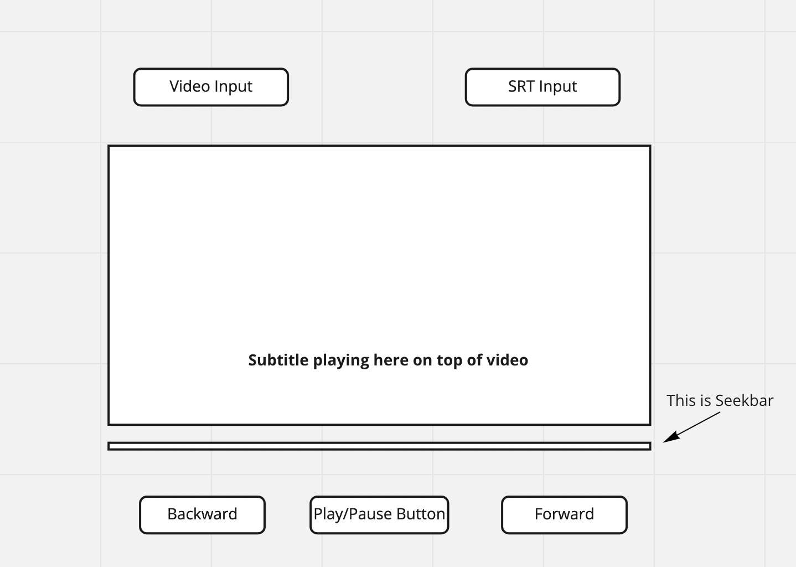

# VidyoAI Frontend Assignment

Use ReactJS to create a Video Player using HTML5 Canvas or a Canvas library of your choice.

It should meet following criteria
1. Use of HTML5 Canvas is a must
2. Take video file as an input
3. Take SRT file as an input 
4. Support play, pause, forward and rewind
5. Seekbar to change current time
6. Subtitles of the video should play in sync with the video

Useful Resources
1. https://reactjs.org/tutorial/tutorial.html
2. https://www.w3schools.com/html/html5_canvas.asp
3. https://blog.hubspot.com/marketing/srt-file

Once you are done please send code github link as well as netlify/vercel link to sourabh@vidyo.ai

Please find rough wireframe below, you are free to change it though

